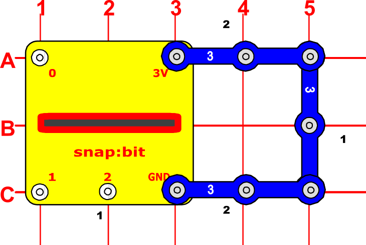

Power the micro:bit on by using a USB cable or its own battery.

The snap:bit has two special snaps – 3V and GND, which are connected to the 3V and GND pins of the micro:bit respectively. If the micro:bit is being powered by USB or its own battery, then the 3V pin can be used as a power output to power other components in the circuit.

When you close the slide switch (S1), current flows from the USB or the battery, through the micro:bit board, the 3V pin of the micro:bit, the switch and the the Lamp (L1), then back to the battery through the GND pin of the micro:bit. This makes the lamp to turn on. When the slide switch is opened, the current can no longer flow back to the battery, so the the lamp turns off.

Note the difference with the [previous project](power-microbit.html) where the micro:bit was not powered by USB or its own battery, but we used the Battery Holder (B1) as the power source. In that case the 3V snap of the snap:bit acted as a power input instead of a power output.

Powering the micro:bit using the USB instead of the Battery Holder (B1) is useful when you frequently update the code in the micro:bit through the USB. This way it is not necessary to unplug the micro:bit from the snap:bit just for the code update and then plug it back in.

#### Beware of short circuits

**Important!** Every circuit powered from the micro:bit must include a resistance (which might be a resistor, lamp, motor, integrated circuit, etc.) between the 3V and GND snaps. You must be careful not to create "short circuits" (very low-resistance paths across the 3V and GND snaps like on the example below) as this may damage the micro:bit, the snap:bit and other circuit components.

