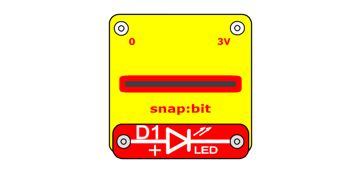

When you close the slide switch (S1), the Battery Holder (B1) powers the snap:bit through the 3V snap and the micro:bit turns on. The "on start" event triggers and the micro:bit writes a digital 1 signal to pin P1. This lets the current flow through the LED (D1) and back through the GND of the snap:bit and the battery.

The positive (+) end of a LED can be connected to any of the O, 1 and 2 snaps of the snap:bit. The negative (-) end of the LED must always be connected to the GND pin of the snap:bit.

Note that the P0, P1 and P2 pins of the micro:bit have a built-in resistor, so it is safe to connect the LED without any additional resistor. If connecting the LED to the 3V snap, you still need to include a resistor like the 100Ω Resistor (R1).

#### Minimal LED connection

You can connect the LED directly across the 1 and GND snaps on top of the snap:bit without any additional wires.

This minimal setup is very useful when experimenting with the code and the micro:bit is connected to the computer. This way you can have just the snap:bit with the LED next to your computer without any additional components.