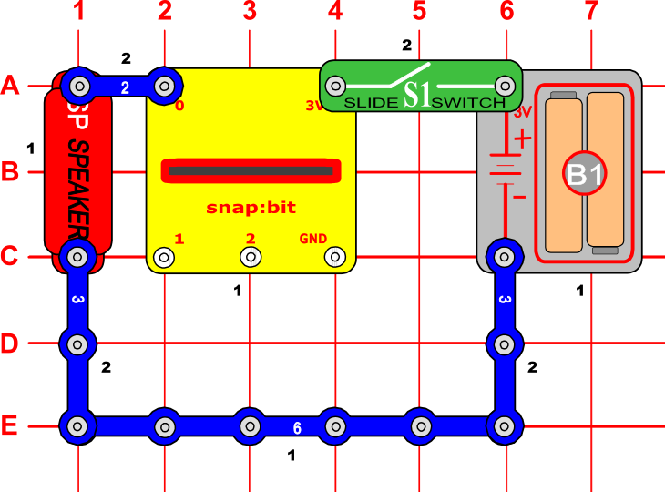
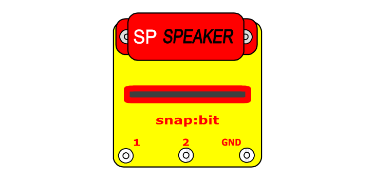

The micro:bit plays music through pin P0. So the Speaker (SP) snaps must be connected across snap 0 and either the 3V or GND snap of the snap:bit.

When you close the slide switch (S1), the Battery Holder (B1) powers the snap:bit through the 3V snap and the micro:bit turns on. The "on start" event triggers and the micro:bit plays the melody. The sound is modulated as a current through snap 0, which goes through the speaker and makes it play the sound.

#### Incorrect connection of the speaker

You must be careful to ground the speaker properly to the micro:bit by connecting it to either the 3V or GND snap of the snap:bit.

Below is an example of an incorrectly connected speaker.

Although the speaker is connected to the batter (-) and the circuit is closed (current can flow from snap 0 of the snap:bit, through the speaker, back to the battery), the melody sounds distorted, because the speaker is not grounded properly to the micro:bit.

#### Minimal speaker connection

You can connect the speaker directly across the 0 and 3V snaps on top of the snap:bit without any additional wires.

This minimal setup is very useful when experimenting with the code and the micro:bit is connected to the computer. This way you can have just the snap:bit with the speaker next to your computer without any additional components.