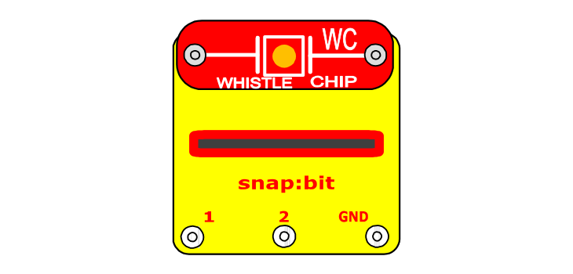

In the [previous project](connect-speaker.html) you have seen how to connect the speaker to snap:bit to play music from the micro:bit. You can replace the speaker with the whistle chip. It works the same way as the speaker. The whistle chip (WC) must be connected across snap 0 and either the 3V or GND snap of the snap:bit.

When you close the slide switch (S1), the Battery Holder (B1) powers the snap:bit through the 3V snap and the micro:bit turns on. The "on start" event triggers and the micro:bit plays the melody. The sound is modulated as a current through snap 0, which goes through the whistle chip and makes it play the sound.

In fact, you will hear louder sound from the whistle chip than from the speaker. This is because the current from pin 0 of the micro:bit is weak. The micro:bit is designed to play music to headphones, not to loudspeakers. The speaker has a higher resistance than the whistle chip. Therefore, the sound from the whistle chip is louder.

#### Minimal whistle chip connection

Just like the speaker, you can connect the whistle chip directly across the 0 and 3V snaps on top of the snap:bit without any additional wires.

This minimal setup is very useful when experimenting with the code and the micro:bit is connected to the computer. This way you can have just the snap:bit with the whistle chip next to your computer without any additional components.